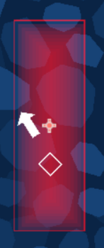
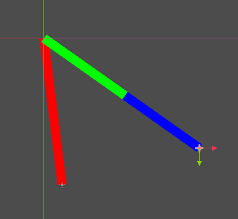

# Roll (Demo)
A geometric speedrunning platformer!

---
## Controls
- Q / Left Click / Space to Jump
- E / Right Click to Dash
- Perform Midair Tricks With WASD
- Play on web / get builds [here](https://baton-0.itch.io/roll)!

## Overview
- The basic gameplay loop is jumping and dashing from spline to spline to reach the goal as fast as possible, while trying to build a score with midair tricks.
- While making this project, I learnt a lot more about making tool scripts for Godot, and made a lot of tools
    - Splines -> Turn a Line2D into a continuous bezier curve. Learnt about splines from [this video](https://youtu.be/jvPPXbo87ds?t=603) - my tool makes the cubic bezier splines mentioned in it, though with slightly more local control
    - TimeSlows -> The time-slowing areas of the game have a custom draw function in-editor, with a red gradient that shows how much time is slowed at any point within the node's radius
    
    - RegularPolygons -> Turns a Polygon2D into a regular polygon, with options for vertice count, radius, etc, as well as the option to cut out another polygon from the center. These are all over, from the menu to the circle parts in the game.
    
        - There's a extended script of these that allows for animating the polygon, specifically for rotating the inner and outer polygons seperately and moving the spikes for some cool effects. It was pretty laggy, though, so the only instance is the simple one on the start screen
- The control script for the player is an absolute monster - and it still has bugs I need to work out. It basically works by applying a sticking force to the wall on contact, shooting a ray in that direction so it'll stay on if the angle changes sharply, and grinding perpendicularly to it. Jumping is just applying a force perpendicular to that grinding direction, and dashing is similar - all using a max(default_force, current_velocity_magnitude) setup so you can keep as much speed as possible. When you hit a wall, it projects (see the image) the current velocity along the wall's direction, and that magnitude is how much you keep.

    - The blue line is the wall direction, the red is the current velocity, and the green is the projected velocity. Imagine the red line if its endpoint hit the start of the green line; the player would travel from the red to the green to start grinding along the wall.

## Credits
- Everything was created by me, including the tools used to make the splines, the vector art, etc.
